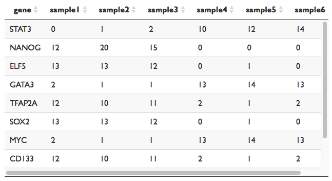

1. Under **Upload a count matrix**, click **Browse...** to select a file from your desktop.

2. Files must be either .csv or .txt (tab-delimited).

3. Count data must be comprised of only integers.

4. Count data must be in gene-by-samples format, with gene symbols in the first column and samples in the remaining columns.

5. Sample names must match the sample names in the metadata table.

6. See the table below for an example of the required layout.

