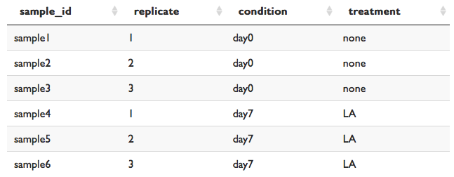

1. Under **Upload metadata**, click **Browse...** to select a file from your desktop.

2. Files must be either .csv or .txt (tab-delimited).

3. Metadata must contain sample names in the first column and metadata variables in the remaining columns.

4. Metadata variables may not be named 'Sample'.

5. Sample names must be identical to sample names in the counts matrix.

6. See the table below for an example of the required layout.

